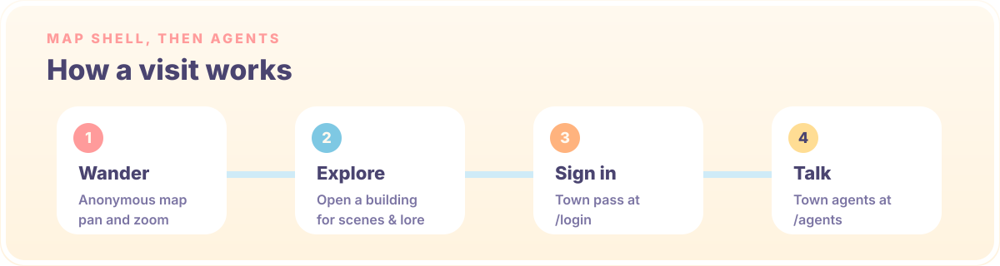

<p align="center">
  <a href="./README.md"></a>
  &nbsp;
  <a href="./README.zh-CN.md"></a>
</p>

<p align="center">
  
</p>

<p align="center">
  <a href="https://github.com/Ginger-Juice/summertown-selfagent"><strong>This repository →</strong></a>
</p>

---

**Magic Town** is a personal self-agent product. The isometric map is the town shell: you can wander it anonymously. Signing in unlocks town residents (agents) with tools, memory, and a Hono + tRPC runtime behind the page.

This repository (`Ginger-Juice/summertown-selfagent`) is an **independent** product. It is not [summerpapaya/summertown](https://github.com/summerpapaya/summertown), and it is not the original Summer Town map site. Some landmark copy, map art, and GitHub Pages DNS still come from that earlier map — they are leftover shell, not this repo's product identity.

<p align="center">
  
</p>

<p align="center">
  
</p>

### The town shell

Anonymous visitors can still:

- **Start exploring** or **take the ferry tour** from the arrival screen
- **Pan and zoom** the isometric town (world canvas: 2400 × 1680)
- **Open landmarks** for scenes and field notes
- **Filter** by Culture, Food, Stay, Magic, or Isle
- **Repaint the sky** with Day, Golden Hour, or Starlight

The fourteen map slots are still the seaside-town buildings. Product chrome (nav, hero, agents) already says Magic Town / 魔法镇; landmark lore has not been rewritten.

| Landmark slot | Chip |
| --- | --- |
| Town Hall & Central Garden | Heart of Town |
| The Seashell Theater | Culture |
| The Gullwing Livehouse | Culture · Night |
| Nook & Cranny General Store | Food & Goods |
| The Pearl Gallery | Culture |
| Café Seabreeze | Food |
| Summer FM 105.5 | On Air |
| The Tidepool Library | Culture |
| Paper Boat Design Lab | Make |
| The Apple Cottage | Food · Home |
| The Magic House | Magic |
| Hotel Horizon | Stay |
| The Three Villas | Stay |
| Windbell Isle | Isle |

Deep links work with `?place=<id>` (for example `?place=coffee`).

<p align="center">
  
</p>

<p align="center">
  
</p>

### Routes

| Route | What it is |
| --- | --- |
| `/` | Interactive town map + field notes |
| `/windbell-isle` | Scroll journey: pier → meadow → pavilion → sunset → lighthouse |
| `/journal` | Passport index, town calendar, postcard wall |
| `/visit` | Ferry timetable, stays, etiquette, packing list |
| `/login` | Town pass — required to talk or register an agent |
| `/agents` | Town residents + your registered agent, chat, memory drawer |
| `/town-admin` | Town admin |
| `/apple-album` · `/apple-admin` | Apple-a-day album (and its admin) |

Eight seeded town agents (clerk, nutritionist, coach, rune wright, barkeeper, mixologist, librarian, tower wizard) live behind `/agents`. Chat is a full model loop (not a stub): builtin OpenAI-compatible providers by default (DeepSeek unless you change `.env`), jailed workspace hands for the rune wright and librarian, Cursor SDK wired for the rune wright when a key is present.

<p align="center">
  
</p>

### Run it

The map shell is a Vite SPA. **Agent chat needs the Node API and MySQL.** `npm run dev` starts both together.

```bash
cp .env.example .env   # DATABASE_URL plus at least one vendor key (DeepSeek is the default)
npm install
npm run dev            # Vite + Hono on http://localhost:3000
```

```bash
npm run build          # frontend → dist/public, API bundle → dist/boot.js
npm start              # production Node server (static files + /api)
npm run check          # tsc -b
npm run lint           # eslint
npm test               # vitest
```

GitHub Pages still publishes **only** the static frontend (`dist/public`) from `main`. That is not the town runtime. The leftover custom domain is still `summertown.summercommences.com` (`CNAME` / `public/CNAME`); this pass does not change DNS or deploy.

### Stack

**Shell:** React 19 · TypeScript · Vite · Tailwind CSS · Framer Motion · GSAP · Lenis · Howler · shadcn/ui

**Town OS:** Hono · tRPC · Drizzle · MySQL · `@cursor/sdk`

Model keys are listed in `.env.example` (DeepSeek default). Art generation, if you touch map assets, is Google Gemini via `scripts/art/generate.mjs` — see `.cursor/rules/art-pipeline.mdc`.

### Made with

- Vibe coding: [Kimi K3 Swarm](https://www.kimi.com/)
- README writing: Cursor Grok 4.5
- README design: [beautify-github-readme](https://github.com/oil-oil/beautify-github-readme)

### Notes

- Best experienced with a mouse or trackpad (custom cursor + map gestures).
- Sound can be toggled from the navbar; respect your own volume.
- The map is anonymous; conversations and agent registration require a town pass.

### License

- **Source code** is released under the [MIT License](./LICENSE).
- **Visual assets** under `public/` (map art, landmarks, scenes, logos, cursors) are **not** MIT-licensed. Many were created with AI assistance; please do not reuse them as standalone assets or project branding without permission. See [NOTICE](./NOTICE).
