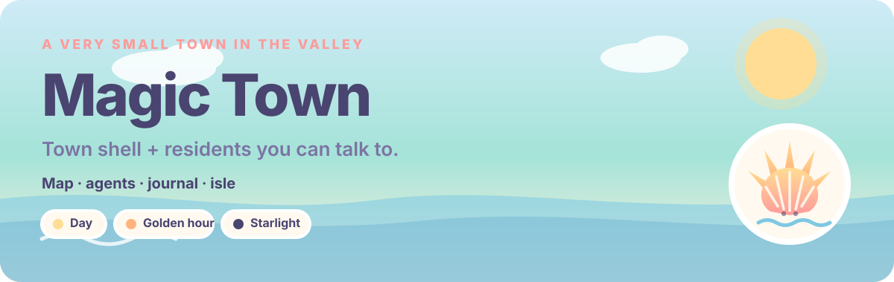
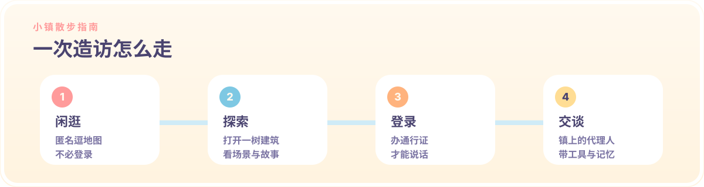

<p align="center">
  <a href="./README.md"></a>
  &nbsp;
  <a href="./README.zh-CN.md"></a>
</p>

<p align="center">
  
</p>

<p align="center">
  <a href="https://github.com/Ginger-Juice/summertown-selfagent"><strong>本仓库 →</strong></a>
</p>

---

**魔法镇（Magic Town）** 是一份个人 self-agent 产品。等距地图是小镇壳：可以匿名闲逛；登录之后才能和镇上的居民（agents）说话。页面后面是 Hono + tRPC 的小镇运行时。

本仓库（`Ginger-Juice/summertown-selfagent`）是**独立产品**。它不是 [summerpapaya/summertown](https://github.com/summerpapaya/summertown)，也不是原来的夏天镇地图站。部分地标文案、地图美术、GitHub Pages 域名仍来自那份早期地图——那是壳的遗留，不是本仓库的产品身份。

<p align="center">
  
</p>

<p align="center">
  
</p>

### 小镇壳

匿名访客仍然可以：

- 从抵达画面 **开始探索**，或 **乘坐渡轮导览**
- **平移与缩放** 等距小镇（世界画布：2400 × 1680）
- **打开地标**，查看场景与田野笔记
- 按 **文化 / 美食 / 住宿 / 魔法 / 小岛** 筛选
- 用 **日间 / 黄金时刻 / 星光** 重绘天空

十四个地图槽位仍是海边小镇的建筑。产品壳（导航、首页、代理人页）已经叫魔法镇 / Magic Town；地标故事还没有整页改写。

| 地标槽位 | 标签 |
| --- | --- |
| 市政厅与中央花园 | 小镇之心 |
| 海螺剧场 | 文化 |
| 鸥翼 Livehouse | 文化 · 夜间 |
| 犄角旮旯杂货铺 | 美食与杂货 |
| 珍珠画廊 | 文化 |
| 海风咖啡馆 | 美食 |
| Summer FM 105.5 | 正在播出 |
| 潮池图书馆 | 文化 |
| 纸船设计工坊 | 制作 |
| 苹果屋 | 美食 · 家 |
| 魔法屋 | 魔法 |
| 地平线酒店 | 住宿 |
| 三栋别墅 | 住宿 |
| 风铃屿 | 小岛 |

深链接可用 `?place=<id>`（例如 `?place=coffee`）。

<p align="center">
  
</p>

<p align="center">
  
</p>

### 路线

| 路线 | 内容 |
| --- | --- |
| `/` | 互动小镇地图 + 田野笔记 |
| `/windbell-isle` | 滚动旅程：长栈桥 → 铃兰草地 → 风铃亭 → 日落点 → 灯塔 |
| `/journal` | 护照索引、小镇日历、明信片墙 |
| `/visit` | 渡轮时刻表、住宿、礼仪、打包清单 |
| `/login` | 小镇通行证 — 说话或登记代理人必须先登录 |
| `/agents` | 镇内居民 + 你登记的代理人、对话、记忆抽屉 |
| `/town-admin` | 小镇管理 |
| `/apple-album` · `/apple-admin` | 每日一苹果相册（及其后台） |

`/agents` 后面种了八位镇内居民（书记官、营养巫师、晨练教练、符文匠、酒保、调酒师、馆长、驻塔巫师）。对话是完整的模型循环，不是占位回复：默认走 OpenAI 兼容的 builtin provider（`.env` 默认 DeepSeek）；符文匠和馆长在 builtin 上有 jailed 工作区手；符文匠在有钥匙时走 Cursor SDK。

<p align="center">
  
</p>

### 运行

地图壳是 Vite SPA。**和代理人聊天需要 Node API 和 MySQL。** `npm run dev` 会一并把两者拉起来。

```bash
cp .env.example .env   # 填 DATABASE_URL，以及至少一把厂商 key（默认 DeepSeek）
npm install
npm run dev            # Vite + Hono，地址 http://localhost:3000
```

```bash
npm run build          # 前端 → dist/public，API 打包 → dist/boot.js
npm start              # 生产 Node 服务（静态文件 + /api）
npm run check          # tsc -b
npm run lint           # eslint
npm test               # vitest
```

GitHub Pages 仍只从 `main` 发布**静态前端**（`dist/public`）。那不是小镇运行时。遗留自定义域名仍是 `summertown.summercommences.com`（`CNAME` / `public/CNAME`）；本轮不动 DNS 与部署。

### 技术栈

**壳：** React 19 · TypeScript · Vite · Tailwind CSS · Framer Motion · GSAP · Lenis · Howler · shadcn/ui

**小镇 OS：** Hono · tRPC · Drizzle · MySQL · `@cursor/sdk`

模型 key 见 `.env.example`（默认 DeepSeek）。若要动地图素材，出图走 Google Gemini（`scripts/art/generate.mjs`），见 `.cursor/rules/art-pipeline.mdc`。

### 制作工具

- 氛围编程（vibe coding）：[Kimi K3 Swarm](https://www.kimi.com/)
- README 文案：Cursor Grok 4.5
- README 设计：[beautify-github-readme](https://github.com/oil-oil/beautify-github-readme)

### 说明

- 更适合鼠标或触控板（自定义光标 + 地图手势）。
- 声音可在导航栏开关；请自行控制音量。
- 地图可匿名逛；对话和登记代理人需要通行证。

### 许可

- **源代码** 采用 [MIT License](./LICENSE) 发布。
- **`public/` 下的视觉素材**（地图、地标、场景、logo、光标等）**不适用** MIT。其中多数借助 AI 生成；请勿在未获许可的情况下，将其作为独立素材或其他项目品牌使用。详见 [NOTICE](./NOTICE)。
